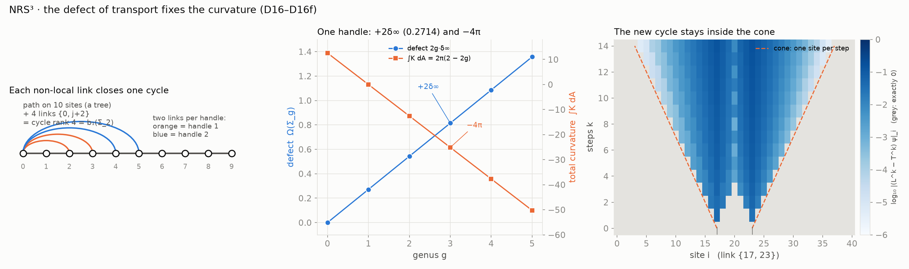
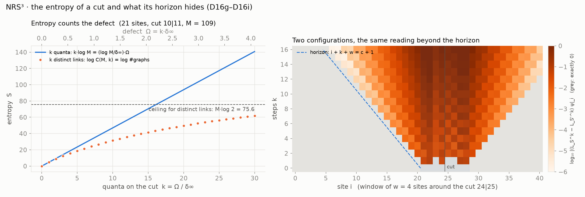
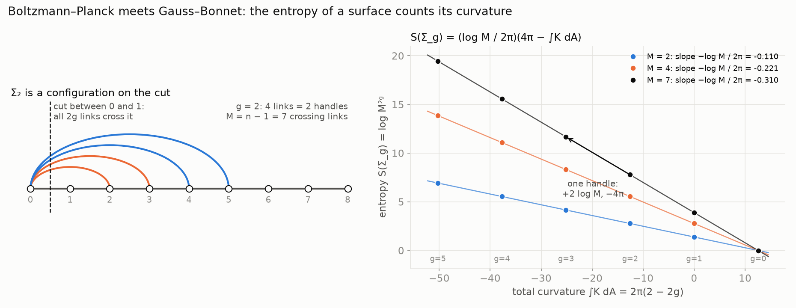

# NRS³ · Defect and curvature

**The defect of transport fixes the curvature.** Transport `T_d` moves on the path, a tree. A
link between two sites closes a cycle exactly when it is not local; every cycle carries one
quantum `δ∞ = C∞ − 1`; `2g` links carry the defect `2g·δ∞` of a closed surface of genus `g`,
and under Gauss–Bonnet that defect fixes its total curvature. The change travels inside the light
cone, one site per step. In Lean 4.

**[▶ Try it: add handles and watch the cone](https://naype888-cloud.github.io/nrs3-defect-curvature/)** ·
**[▶ Try it: the entropy of a cut and of a surface](https://naype888-cloud.github.io/nrs3-defect-curvature/entropy.html)** ·
**[Rovelli's *Reality Is Not What It Seems*, chapter by chapter](https://naype888-cloud.github.io/nrs3-defect-curvature/rovelli.html)**



## Results

| Statement | Lean |
|---|---|
| the path with `2g` links `{0, j + 2}` has cycle rank `2g`, defect `Ω(Σ_g) = 2g·δ∞` and `∫K dA = 4π − (2π/δ∞) Ω(Σ_g)` | `defect_fixes_curvature` |
| one handle is two links: `+2δ∞` of defect and `−4π` of curvature | `handle_quanta` |
| a link closes a cycle iff it joins sites at distance `≥ 2` | `cycle_iff_far` |
| the new cycle is unseen at distance `≥ k` for `k` steps, for every state | `link_inside_cone` |
| at `d = 2, 3` the defect is `0` while the curvature still jumps; from `d = 4`, `0 < 2δ(d) < 2δ∞` | `quantum_by_dimension` |

### Entropy and horizon



| Statement | Lean |
|---|---|
| `k` quanta on the `M` crossing links of a cut have entropy `k log M = (log M / δ∞)·Ω`; `k` distinct links are exactly the graphs with `k` new cycles | `entropy_counts_defect` |
| a far site reads every configuration of `m` links near the cut as plain transport for `k` steps; `C(M_w, m)` of them, each with defect `m δ∞` | `horizon_hides_entropy` |
| under the declared bridge `S = A/(4ℓ_P²)`, `A = a₀ Ω`, the area per unit of defect is `a₀ = 4ℓ_P² log M / δ∞` | `bekenstein_hawking_fixes_area` |

### The entropy of a surface counts its curvature

The `2g` links of `Σ_g` all cross the cut between the sites `0` and `1`, so the surface is one of
the configurations the entropy counts. Boltzmann–Planck `S = log W`, `W = M^{2g}`, and Einstein's
curvature through Gauss–Bonnet give one line:

**`S(Σ_g) = (log M / 2π) · (4π − ∫K dA)`**

| Statement | Lean |
|---|---|
| the graph of `Σ_g` is the path with the links `{0, j + 2}` | `handleGraph_eq_linksGraph` |
| those `2g` links are a configuration of `2g` quanta on the cut at `0`, with the graph of `Σ_g` | `handleLinks_mem` |
| `S(Σ_g) = (log M / 2π)(4π − ∫K dA)` | `entropy_eq_curvature` |
| one handle: `2 log M` of entropy and `−4π` of curvature | `entropy_handle_step` |

`δ∞` cancels in the ratio and stays positive in each link: the defect is not swept away. The only
hypothesis is `HGaussBonnet`.



The proofs are the modules `D16`–`D16i` of the
[base repository](https://github.com/naype888-cloud/nava-robertson-schrodinger), which this package requires;
`NRS3DefectCurvature/Chain.lean` and `NRS3DefectCurvature/Entropy.lean` state them in one place;
`NRS3DefectCurvature/EntropyCurvature.lean` joins the two.

## What is declared

- **Gauss–Bonnet**, `∫K dA = 2πχ` (`HGaussBonnet`): Mathlib has no Gauss–Bonnet. It is shown
  satisfiable.
- **Bekenstein–Hawking**, `S = A/(4ℓ_P²)` (`HBekensteinHawking`): the `1/4` and the scale are
  not derived; the bridge is shown satisfiable. The coefficient `log M` depends on the cut.
  The horizon here is the finite-time light cone, not a black hole.
- The classical cell structure of `Σ_g`, whose `1`-skeleton has `2g` independent cycles. The
  graph of transport realizes those `2g` cycles (`cycleRank_handleGraph`); that it is the
  `1`-skeleton of a surface is not formalized.

Nothing here is a claim about spin or mass. The interior of the path is flat (`D28`, `D28b` in
the base repository): the curvature lives in the cycles, not on sites.

## Build

Lean 4 `v4.34.0`, Mathlib `v4.34.0` through the base repository.

```bash
lake exe cache get
lake build
lake env lean Verification/Axioms.lean   # only propext, Classical.choice, Quot.sound
```

Every file: no `sorry`, lines of at most 100 characters, English headers. The figure:
`python3 docs/simulation/figures_defect_curvature.py` and
`figures_entropy_horizon.py`.

## Timeline 1911–1945

NRS answers a question of the Solvay era with later tools. The series is placed in that window:
what falls inside it is the history the theorem belongs to; what falls after it is a proposal,
not part of NRS³.

| Year | Event | Repository |
|---|---|---|
| 1911 | First Solvay conference: radiation and the quanta | |
| 1911–12 | Poincaré: Planck's law forces discrete levels | [`nrs3-poincare`](https://github.com/naype888-cloud/nrs3-poincare) |
| 1915–20 | Szegő: limit theorems for Toeplitz matrices (the limit `C∞`, `D8`) | [base repository (NRS, NRS³)](https://github.com/naype888-cloud/nava-robertson-schrodinger) |
| 1917–27 | Einstein and de Sitter: `Λ` and the empty universe; Friedmann and Lemaître: the expanding universe | [`nrs3-de-sitter`](https://github.com/naype888-cloud/nrs3-de-sitter) |
| 1925–27 | Pauli: exclusion, shells `2n²`, spin matrices | [`nrs3-pauli-dirac`](https://github.com/naype888-cloud/nrs3-pauli-dirac) |
| 1927 | Heisenberg's relation; fifth Solvay conference: electrons and photons | |
| 1928 | Dirac: the `4 × 4` gamma matrices | [`nrs3-pauli-dirac`](https://github.com/naype888-cloud/nrs3-pauli-dirac) |
| **1929–30** | **Robertson and Schrödinger: the uncertainty inequality** | **[base repository (NRS, NRS³)](https://github.com/naype888-cloud/nava-robertson-schrodinger)** |
| 1945–46 | Mandelstam–Tamm: the time–energy bound; Rao (1945), Cramér (1946) | [`nrs3-mandelstam-tamm-cramer-rao`](https://github.com/naype888-cloud/nrs3-mandelstam-tamm-cramer-rao) |

**Tools from after the window.** Niven (1956: rational values of the trigonometric functions),
Fiedler (1973: algebraic connectivity), Lean 4 and Mathlib (the verification). The question is
of 1929; the tools are later; the checking is of 2026.

**After the window: proposals, not NRS³.** [`nrs3-penrose`](https://github.com/naype888-cloud/nrs3-penrose) (Penrose 1996, gravity-related
collapse) and [`nrs3-rovelli-lqg`](https://github.com/naype888-cloud/nrs3-rovelli-lqg) (loop quantum gravity, area spectrum 1995). They use NRS³ results
but their physical readings belong to quantum information and quantum gravity.
**[`nrs3-defect-curvature`](https://github.com/naype888-cloud/nrs3-defect-curvature)** (this one) restates base theorems (`D16`–`D16i`); its Bekenstein–Hawking (1973–75) reading
is a declared bridge.

## The mosaic

- [NRS and NRS³ — the base theorem](https://github.com/naype888-cloud/nava-robertson-schrodinger)
- [NRS³ · Mandelstam–Tamm and Cramér–Rao](https://github.com/naype888-cloud/nrs3-mandelstam-tamm-cramer-rao)
- [NRS³ · Landauer and Carnot](https://github.com/naype888-cloud/nrs3-landauer-carnot)
- [NRS³ · de Sitter](https://github.com/naype888-cloud/nrs3-de-sitter)
- [NRS³ · Penrose](https://github.com/naype888-cloud/nrs3-penrose) (proposal)
- [NRS³ · Pauli–Dirac](https://github.com/naype888-cloud/nrs3-pauli-dirac)
- [NRS³ · Poincaré](https://github.com/naype888-cloud/nrs3-poincare)
- **[NRS³ · Defect and curvature](https://github.com/naype888-cloud/nrs3-defect-curvature)** (this one)
- [NRS³ · Rovelli — Loop Quantum Gravity](https://github.com/naype888-cloud/nrs3-rovelli-lqg) (proposal)

## License

NRS Noncommercial License 1.0.0, see [`LICENSE`](LICENSE). Author: Eduardo Nava-Hernandez.
